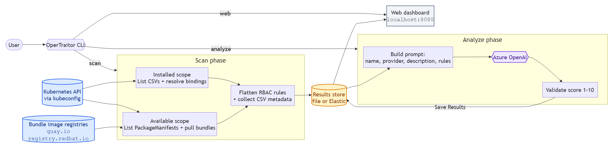

# OperTraitor

OperTraitor scans Kubernetes operators for the RBAC permissions they request, optionally rates how risky those permissions are using Azure OpenAI, and serves a local web dashboard to browse the results.

<p align="center">
  
</p>

## How it works: the four modes

You choose what OperTraitor does with the `--mode` flag:

| Mode | What it does | Needs a running cluster? |
|---|---|---|
| `scan` | Collects the RBAC permissions operators request and saves them. Which operators it looks at depends on `--scope` (see below). | Yes |
| `analyze` | Sends already-saved results to Azure OpenAI for a risk rating. | No |
| `all` | Runs `scan` and then `analyze` in a single run. **This is the default.** | Yes |
| `web` | Opens a local dashboard to browse already-saved results. | No |

### What gets scanned: `installed` vs. `available`

When scanning, the `--scope` flag chooses *which* operators OperTraitor inspects:

- **`installed`** - operators currently deployed in your cluster. OperTraitor reads the live RBAC they actually hold right now.
- **`available`** - operators offered by the catalogs your cluster knows about (for example, the community OperatorHub catalog that OLM installs). OperTraitor downloads each operator's package from the image registry and reads the RBAC it *would* request if you installed it - these operators do not have to be installed.
- **`all`** - both of the above. **This is the default scope.**

The rest of this guide is organized around these modes.

## Prerequisites

You only need the things that match the mode you plan to run.

**Always needed (to build the tool):**

- **Go 1.25+** (see go.mod).

**To scan - `scan` or `all` mode:**

- **A running Kubernetes cluster** you can reach, plus its **kubeconfig** file (default: `C:\Users\<you>\.kube\config`).
- **OLM (Operator Lifecycle Manager) installed in that cluster.** OLM is the standard system for installing and managing operators, and OperTraitor can only see operators that OLM knows about. How you get it:
  - **OpenShift** clusters already include OLM - nothing to do.
  - **Plain Kubernetes** (minikube, kind, Docker Desktop, Rancher Desktop, etc.): install it once by following the [OLM quick start](https://olm.operatorframework.io/docs/getting-started/). The short version is to run `operator-sdk olm install`. This also adds the community **OperatorHub catalog**, which is what the `available` scope reads.

**To analyze - `analyze` or `all` mode:**

- **Azure OpenAI credentials** (provided as environment variables - see [Environment variables reference](#environment-variables-reference)).

**Optional - only if you store results in Elastic instead of a local file:**

- **Elastic Cloud credentials.**

## Build

```powershell
go build -o opertraitor.exe
```

All examples below assume you have built `opertraitor.exe` in the current directory.

## Run modes (Windows PowerShell)

### 1) Scan operators (RBAC collection)

Scan installed operators only:

```powershell
.\opertraitor.exe --mode scan --scope installed --output file --file-path .\opertraitor-output.json
```

Scan available operators only (catalog):

```powershell
.\opertraitor.exe --mode scan --scope available --output file --file-path .\opertraitor-output.json
```

Scan both installed and available (default scope=all):

```powershell
.\opertraitor.exe --mode scan --scope all --output file --file-path .\opertraitor-output.json
```

### 2) Analyze stored results (Azure OpenAI)

Analysis requires persistent storage (file or Elastic). Set the Azure credentials first:

```powershell
$env:AZ_API_KEY = "<your-azure-openai-key>"
$env:AZ_ENDPOINT = "https://<your-resource-name>.openai.azure.com/"
```

Analyze a file-based scan output:

```powershell
.\opertraitor.exe --mode analyze --output file --file-path .\opertraitor-output.json
```

Optional tuning:

```powershell
.\opertraitor.exe --mode analyze --output file --file-path .\opertraitor-output.json --az-model gpt-5.4 --az-temp 0.7 --az-workers 12
```

### 3) Scan + analyze in one run

```powershell
$env:AZ_API_KEY = "<your-azure-openai-key>"
$env:AZ_ENDPOINT = "https://<your-resource-name>.openai.azure.com/"
.\opertraitor.exe --mode all --scope all --output file --file-path .\opertraitor-output.json
```

### 4) Web UI (local dashboard)

The web UI reads from your stored scan output (file storage by default). Run a scan first to create the file, then start the web UI:

```powershell
.\opertraitor.exe --mode web --file-path .\opertraitor-output.json --address 127.0.0.1 --port 8080
```

To allow access from other machines on your network - requires the explicit opt-in flag because the web UI has no authentication:

```powershell
.\opertraitor.exe --mode web --file-path .\opertraitor-output.json --address 0.0.0.0 --port 8080 --allow-public-bind
```

## Storage options

The `--output` flag chooses where scan results go. There are three options:

- **Print (default)** - when `--output` is omitted, results are printed to stdout. This is write-only with no persistent storage, so it is only useful for a quick `scan` when you just want to eyeball the results. Because there is nothing to read back, it **cannot be used with `analyze`** (or the analyze phase of `all`) - those modes require `file` or `elastic`.
- **File** - `--output file --file-path .\opertraitor-output.json`
- **Elastic** - `--output elastic` plus credentials:

```powershell
$env:ES_CLOUD_ID = "<your-cloud-id>"
$env:ES_API_KEY = "<your-api-key>"
.\opertraitor.exe --mode scan --scope all --output elastic --es-index opertraitor-rbac
```

## Filters

Limit to a specific operator name and/or version:

```powershell
.\opertraitor.exe --mode scan --scope all --operator-name "prometheus" --operator-version "0.73.0" --output file --file-path .\opertraitor-output.json
```

## Environment variables reference

All credentials are passed via environment variables. They are never accepted as CLI flags to avoid leaking secrets into shell history and process listings.

| Variable | Required for | Description |
|---|---|---|
| `AZ_API_KEY` | `--mode analyze` / `--mode all` | Azure OpenAI API key |
| `AZ_ENDPOINT` | `--mode analyze` / `--mode all` | Azure OpenAI endpoint URL, e.g. `https://<resource>.openai.azure.com/` |
| `ES_CLOUD_ID` | `--output elastic` | Elastic Cloud ID |
| `ES_API_KEY` | `--output elastic` | Elastic API key |

None of these are required for a basic file-based scan (`--mode scan --output file`).

## CLI flags reference

| Flag | Default | Description |
|---|---|---|
| `--mode` | `all` | `scan`, `analyze`, `all`, or `web` |
| `--scope` | `all` | `installed`, `available`, or `all` (scan phase only) |
| `--output` | _(print to stdout)_ | `file` or `elastic` |
| `--file-path` | `opertraitor-output.json` | Path to the JSON output file |
| `--kubeconfig` | `~/.kube/config` | Path to kubeconfig |
| `--address` | `127.0.0.1` | Web UI bind address |
| `--port` | `8080` | Web UI port |
| `--allow-public-bind` | `false` | Required when `--address` is not loopback |
| `--az-model` | `gpt-5.4` | Azure OpenAI deployment/model name |
| `--az-temp` | `0.7` | LLM temperature |
| `--az-workers` | `12` | Parallel analysis workers |
| `--es-index` | `opertraitor-rbac` | Elastic index name |
| `--operator-name` | _(all)_ | Filter scan/analysis to operators matching this name |
| `--operator-version` | _(all)_ | Filter scan/analysis to this exact version |

## Troubleshooting

**`dial tcp ... connectex: No connection could be made`**

```
Could not build RBAC cache: failed to list ClusterRoleBindings: dial tcp 127.0.0.1:...: connectex: No connection could be made because the target machine actively refused it.
```

This means the tool cannot reach a Kubernetes API server. Causes and fixes:

- **Cluster is not running** - start your local cluster (Docker Desktop, Rancher Desktop, minikube, etc.) before running a scan.
- **Wrong kubeconfig context** - run `kubectl config current-context` to verify you are pointing at the right cluster. Switch with `kubectl config use-context <name>`.
- **`--scope available` still requires a reachable cluster.** It extracts RBAC by pulling operator bundle images from the registry (e.g. quay.io), but it first lists `PackageManifests` from the cluster's OLM package server to discover which operators exist. There is no offline catalog mode: without a running API server (with OLM installed), the scan cannot enumerate operators to fetch.

This tool was developed for research purposes to illustrate the findings in our blog. It is provided as-is and should be thoroughly reviewed before running against production clusters.